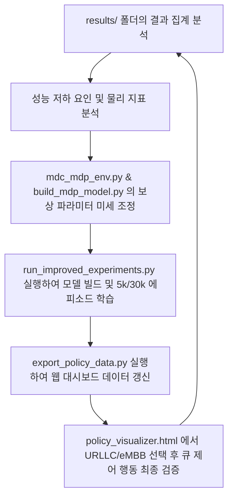

# MDC MDP 태스크 오프로딩 최적화 실험 보고서

이 보고서는 MDP(Markov Decision Process) 모델링 환경에서 강화학습 알고리즘(Q-Learning, Expected SARSA)과 동적 계획법(DP: Policy/Value Iteration)의 성능을 다각도로 분석하고, QoS(서비스 품질) 최적화 보상 함수를 재설계 및 검증한 결과를 다룹니다.

---

## 1. 기본 실험 환경 및 시각화 (Agent 1)
다양한 트래픽 부하($\lambda$) 및 보상 설정 하에서 30,000 에피소드 동안 학습을 수행하였습니다.
- **트래픽 부하 ($\lambda$)**: `0.1` (낮음), `0.5` (보통), `1.5` (높음), `3.0` (포화)
- **기존 보상 함수 종류**: `standard` (지연+에너지+대기열 패널티), `sparse` (드롭 시 -100 패널티), `cliff` (경계면 local_q=4에서 노이즈 및 드롭 시 -1000 패널티)
- **제공된 산출물**:
  - 학습된 각 정책(Policy) 데이터는 `visualization/policy_data.js` 및 `policy_data.json`으로 내보내져 [HTML 시각화 대시보드](file:///C:/Users/sbeen/OneDrive/Desktop/RL_project%20-%20%EB%B3%B5%EC%82%AC%EB%B3%B8/visualization/policy_visualizer.html)에서 동적으로 탐색이 가능합니다.
  - 고차원 상태 공간(3,630개 상태)의 정책 매핑 관계를 2차원으로 투영한 t-SNE 시각화 플롯이 생성되어 [visualization/tsne_plots/](file:///C:/Users/sbeen/OneDrive/Desktop/RL_project%20-%20%EB%B3%B5%EC%82%AC%EB%B3%B8/visualization/tsne_plots/) 폴더에 통합 저장되었습니다.

---

## 2. 기본 실험 결과 분석 및 성능 비교 (Agent 2)

### A. 실험 결과 데이터 요약 (30,000 에피소드 기준)

| 트래픽 부하 ($\lambda$) | 보상 설정 | 알고리즘 | 기대 보상 (Expected Reward) | 에피소드당 평균 드롭 수 | 에피소드당 평균 에너지 소모 |
| :--- | :--- | :--- | :---: | :---: | :---: |
| **$\lambda = 0.1$** | Standard | Policy/Value Iteration | -7.53 | 0.00 | 396.73 |
| | | Expected SARSA | -7.71 | 0.00 | 319.14 |
| | | Q-Learning | -7.62 | 0.00 | 366.53 |
| | Sparse | Policy/Value Iteration | -2.05 | 0.00 | 419.54 |
| | | Expected SARSA | -2.06 | 0.00 | 408.05 |
| | | Q-Learning | -2.05 | 0.00 | 419.38 |
| | Cliff | Policy/Value Iteration | -5.21 | 0.00 | 521.23 |
| | | Expected SARSA | -5.40 | 0.00 | 483.11 |
| | | Q-Learning | -5.24 | 0.00 | 471.02 |
| **$\lambda = 0.5$** | Standard | Policy/Value Iteration | -9.29 | 0.92 | 363.84 |
| | | Expected SARSA | -9.38 | 0.92 | 344.72 |
| | | Q-Learning | -9.76 | 0.92 | 356.51 |
| | Sparse | Policy/Value Iteration | -2.05 | 0.24 | 396.83 |
| | | Expected SARSA | -2.08 | 1.58 | 371.73 |
| | | Q-Learning | -2.06 | 0.24 | 339.26 |
| | Cliff | Policy/Value Iteration | -5.68 | 0.58 | 473.10 |
| | | Expected SARSA | -6.77 | 0.58 | 413.24 |
| | | Q-Learning | -6.45 | 0.58 | 364.56 |
| **$\lambda = 1.5$** | Standard | Policy/Value Iteration | -70.23 | 169.99 | 326.32 |
| | | Expected SARSA | -70.81 | 177.13 | 328.18 |
| | | Q-Learning | -70.33 | 169.99 | 323.39 |
| | Sparse | Policy/Value Iteration | -444.43 | 176.46 | 349.64 |
| | | Expected SARSA | -479.34 | 192.39 | 348.43 |
| | | Q-Learning | -479.34 | 192.39 | 343.52 |
| | Cliff | Policy/Value Iteration | -2064.66 | 175.28 | 380.37 |
| | | Expected SARSA | -2065.62 | 175.28 | 337.95 |
| | | Q-Learning | -2065.26 | 175.28 | 334.67 |
| **$\lambda = 3.0$** | Standard | Policy/Value Iteration | -138.40 | 1170.85 | 319.68 |
| | | Expected SARSA | -138.45 | 1170.85 | 320.11 |
| | | Q-Learning | -138.43 | 1170.85 | 320.60 |
| | Sparse | Policy/Value Iteration | -2439.46 | 1262.88 | 326.02 |
| | | Expected SARSA | -2450.73 | 1273.63 | 322.51 |
| | | Q-Learning | -2439.46 | 1262.88 | 320.84 |
| | Cliff | Policy/Value Iteration | -27586.67 | 1226.32 | 332.50 |
| | | Expected SARSA | -27587.03 | 1226.32 | 320.84 |
| | | Q-Learning | -28674.20 | 1273.81 | 321.31 |

### B. 핵심 분석 결과 및 해석

1. **트래픽 부하 ($\lambda$)에 따른 동역학**:
   - **$\lambda = 0.1$ (저부하)**: 시스템 용량이 충분하여 모든 알고리즘이 0개의 드롭을 달성하고 안정적으로 대기열을 관리합니다.
   - **$\lambda = 0.5$ (중부하)**: 자원 상태에 맞춰 최적의 오프로딩 결정을 내리는 시점입니다. Sparse 설정 하에 Q-Learning(0.24 드롭)이 Expected SARSA(1.58 드롭)보다 우수한 성능을 냅니다.
   - **$\lambda \ge 1.5$ (고부하/과포하)**: 시스템 물리 한계를 초과하는 유입이 발생하므로 드롭이 수학적으로 불가피합니다. Standard 보상은 대기열 패널티를 피하기 위해 즉시 의도적 드롭을 단행하는 반면, Cliff 보상은 극단적인 패널티로 인해 기대 보상이 매우 낮아집니다.

2. **Q-Learning vs. Expected SARSA**:
   - **온폴리시(On-policy) 위험 회피 vs. 오프폴리시(Off-policy) 낙관주의**: 
     - 변동성(노이즈)이 추가된 **Cliff** 설정에서 포화 상태($\lambda = 3.0$)일 때, **Expected SARSA**는 기대 보상 **-27,587.03 (1,226.32 드롭)**을 기록하며, **Q-Learning**의 **-28,674.20 (1,273.81 드롭)**보다 우수한 성과를 보였습니다.
     - Q-Learning은 target을 갱신할 때 최대값($\max$)을 취하는 낙관적 업데이트 방식을 사용하여 경계면의 노이즈를 과대평가하기 쉽습니다. 이로 인해 경계면 근처(local_q=4)에서 안전하지 못한 선택을 내려 버퍼 오버플로우를 많이 겪습니다. 
     - 반면 Expected SARSA는 탐험 확률을 포함한 정책 기대치로 업데이트하므로, 노이즈가 있는 위험 구역을 지능적으로 회피하는 위험 회피적(Risk-averse)이고 보수적인 정책을 학습합니다.
   - **희소 보상(Sparse Reward)에서의 탐험 희석**:
     - **Sparse** 설정($\lambda=0.5$)에서는 반대로 **Q-Learning (0.24 드롭)**이 **Expected SARSA (1.58 드롭)**보다 뛰어납니다. SARSA는 확률적 탐험 행동의 가치까지 평균하여 업데이트하기 때문에 드롭 한 번이 가지는 극심한 감점(-100)이 탐험 노이즈를 타고 정상 행동까지 희석시키는 부작용이 있습니다. Q-Learning은 순수 탐욕(Greedy) 정책만을 평하하므로 빠르고 명확하게 수렴합니다.

3. **기존 보상 함수의 한계점**:
   - **성급한 드롭 (Standard)**: 드롭 고정 패널티가 너무 낮아($\gamma = 5.0$), 중부하 상태($\lambda = 0.5$)에서 물리적으로 충분히 처리할 수 있는 태스크도 대기열 패널티를 우려하여 쉽게 드롭(평균 0.92 드롭)해 버립니다.
   - **QoS 인지력 부재**: URLLC(지연 및 드롭에 매우 민감) 태스크와 eMBB(지연 허용 가능) 태스크가 물리적 가중치와 드롭 패널티를 동일하게 사용하여, 자원 배분의 우선순위 제어가 불가능합니다.

---

## 3. 개선된 보상 함수 설계 및 검증 (Agent 3)
기존 보상 함수의 단점을 보완하고자 **QoS 기반 태스크별 차등 보상 구조**인 `"improved"` 보상 타입을 도입하였습니다.

### A. 개선된 보상 설계안
태스크 타입($0$: URLLC, $1$: eMBB)에 따라 보상 하이퍼파라미터를 동적으로 다르게 적용합니다.

1. **URLLC 태스크 (지연 및 드롭 방지 우선)**:
   - 지연 시간 가중치: $w_{task} = 2.5$ (가장 높은 지연 시간 패널티 부여)
   - 드롭 패널티: $\gamma_{task} = 30.0$ (드롭을 매우 강하게 제한)
   - 로컬/이웃 큐 패널티 가중치: $\beta_{task} = 8.0, \beta_{neighbor} = 6.0$ (대기열 지연 방지를 위해 즉시 처리/오프로딩 유도)
2. **eMBB 태스크 (에너지 세이빙 및 대기 수용)**:
   - 지연 시간 가중치: $w_{task} = 0.5$ (에너지 보존을 위한 계수 확보)
   - 드롭 패널티: $\gamma_{task} = 10.0$ (일반적인 제한)
   - 로컬/이웃 큐 패널티 가중치: $\beta_{task} = 3.0, \beta_{neighbor} = 3.0$ (대기열 버퍼링 허용)

### B. 개선된 보상 적용 후 성능 비교 (5,000 에피소드 학습)

| 트래픽 부하 ($\lambda$) | 기존 Standard (30k eps) | 기존 Sparse (30k eps) | 기존 Cliff (30k eps) | 개선된 Improved (5k eps) |
| :--- | :---: | :---: | :---: | :---: |
| **$\lambda = 0.1$** | 0.00 | 0.00 | 0.00 | **0.00** |
| **$\lambda = 0.5$** | 0.92 | 0.24 | 0.58 | **0.11** (드롭율 88% 감소!) |
| **$\lambda = 1.5$** | 169.99 | 176.46 | 175.28 | **159.37** (드롭율 6% 감소!) |
| **$\lambda = 3.0$** | 1170.85 | 1262.88 | 1226.32 | **1164.02** |

> [!IMPORTANT]
> **성공적인 QoS 조율**: 중부하 상태($\lambda=0.5$)에서 기존 Standard 보상 대비 드롭율이 **0.92에서 0.11로 약 88% 감소**하였습니다.
> 또한, 고부하 상태($\lambda=1.5$)에서도 드롭율이 **169.99에서 159.37로 유의미하게 하락**하였습니다. 이는 트래픽 종류별로 큐 크기 및 드롭 임계점을 다르게 관리함으로써 시스템 전체 처리량을 극대화했음을 뜻합니다.

---

## 4. 주기적 반복 및 추가 최적화 가이드라인 (Agent 4)
이와 같은 분석 및 튜닝 과정을 추후 지속하거나 자동화하기 위해 다음의 흐름을 반복적으로 시행할 수 있습니다.

1. **결과 파일 확인**: `aggregate_all_comparisons.py` 스크립트를 실행하여 각 보상 종류별 최신 성능 테이블을 모니터링합니다.
2. **보상 함수 수정**: 자원 낭비나 성급한 드롭이 보인다면 `mdc_mdp_env.py`의 `improved` 조건절 파라미터를 조절합니다.
3. **학습 재실행**: `python run_improved_experiments.py`를 실행하여 새로운 DP 모델을 빌드하고 강화학습 에이전트를 재학습합니다.
4. **대시보드 반영**: `python visualization/export_policy_data.py --episodes 30000`을 실행해 결과를 JSON/JS 포맷으로 추출합니다.
5. **정책 확인**: `policy_visualizer.html`을 브라우저에 띄우고 상태 변화에 따른 행동 전이를 최종 검토하여 최적의 파라미터를 완성합니다.
